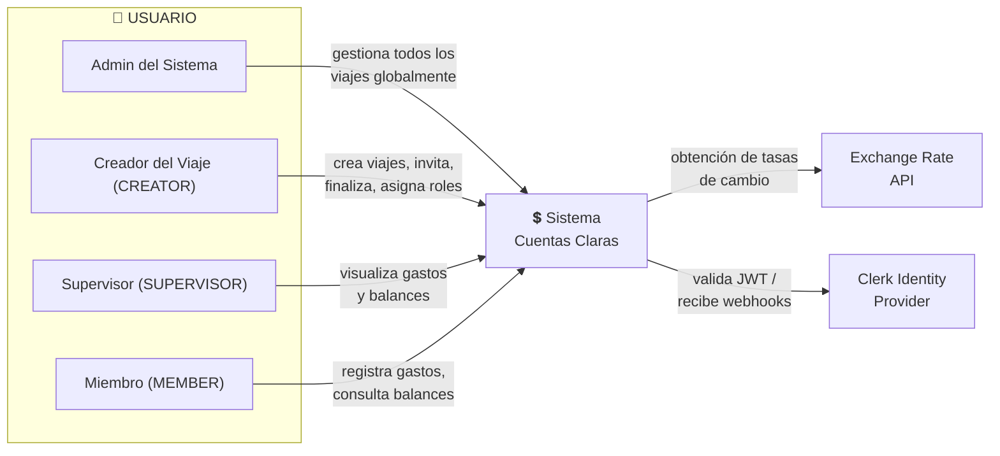
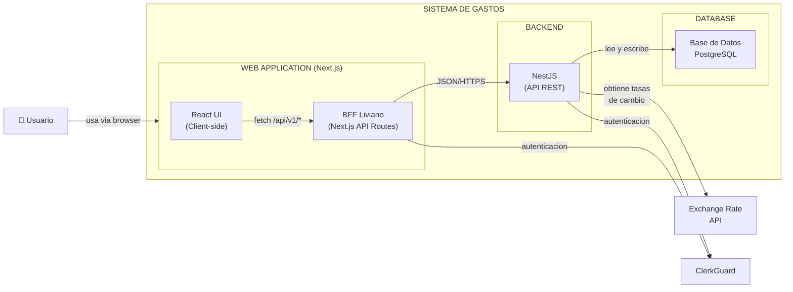
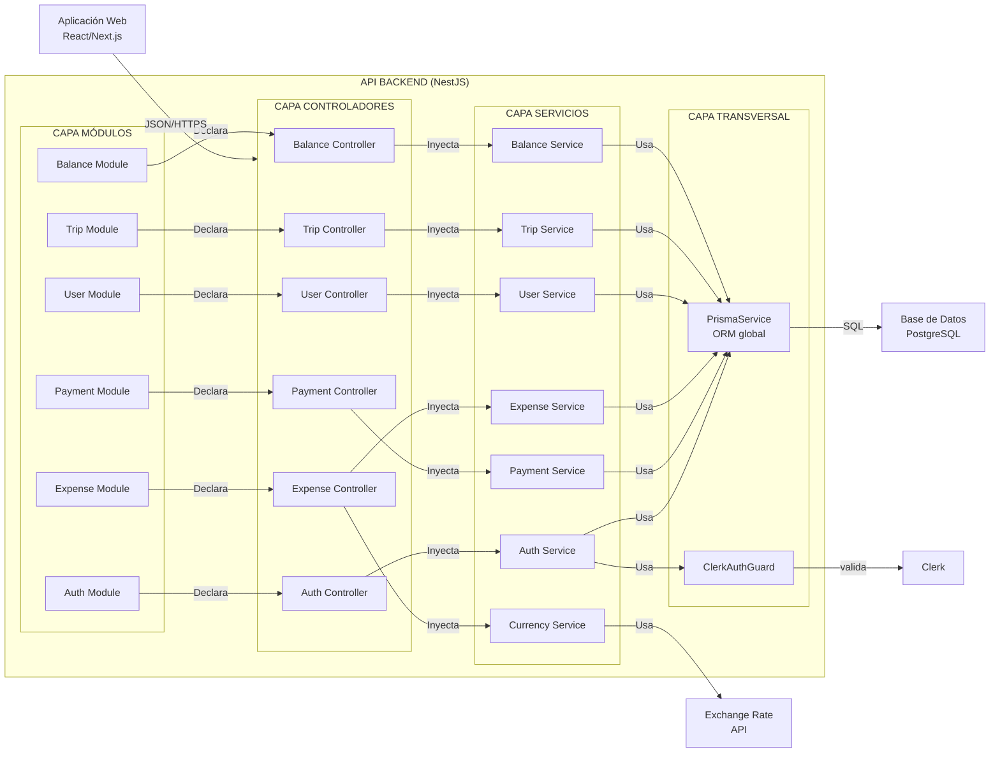

# Diagramas de Arquitectura

---

## Diagrama de Contexto

El diagrama representa al sistema como una "caja negra" central que interactúa con tres tipos de **perfiles de usuario autenticados** y una entidad externa automatizada.
Su objetivo principal es centralizar la gestión financiera de los viajes, permitiendo el registro, la consulta y la administración de deudas y pagos entre participantes.

El sistema identifica 6 entidades principales que interactúan con él:

### Usuarios

El modelo de roles tiene dos niveles: **global** (Admin del sistema) y **por viaje** (CREATOR, SUPERVISOR, MEMBER).

- **Admin del Sistema:** Usuario con permisos globales sobre todos los viajes del sistema. Accede a los endpoints `/admin/*` para listar, ver, modificar y eliminar cualquier viaje sin requerir participación. Es un rol interno, no asignable desde la UI.
- **Creador del Viaje (CREATOR):** Rol por viaje con máximos permisos dentro del mismo. El usuario que crea un viaje se asigna automáticamente como CREATOR. Puede **invitar usuarios, finalizar el viaje, eliminar el viaje, cambiar roles** de otros participantes a SUPERVISOR o MEMBER, y **eliminar participantes**. Es un rol único por viaje (solo una persona puede ser CREATOR).
- **Supervisor (SUPERVISOR):** Un perfil con permisos de lectura. Su interacción principal es la **visualización de gastos y balances**, para un control o auditoría sin intervenir en la carga de datos.
- **Miembro (MEMBER):** Es el usuario activo estándar. Sus funciones principales son **registrar gastos** realizados durante el viaje y **consultar balances** (quién debe a quién y cuánto). Es el rol por defecto al aceptar una invitación.

### Sistemas Externos

- **Exchange Rate API:** Una interfaz de programación externa que el sistema consulta de forma automática para **obtener tasas de cambio**. La aplicación tiene la capacidad de manejar gastos en múltiples divisas y convertirlos a una moneda base de forma actualizada.
- **Clerk Identity Provider:** Un servicio externo de gestión de identidad y autenticación. El sistema interactúa con Clerk para validar tokens JWT y recibir webhooks, asegurando así que solo los usuarios autenticados puedan acceder y operar en la plataforma.

---

## Diagrama de Contenedores

### Web Application (Frontend — Next.js)

- React UI (client-side) + BFF Liviano (Next.js API Routes, server-side)
- **Responsabilidad:** Es el contenedor con el que el usuario interactúa directamente a través de un navegador. Se encarga de renderizar la interfaz, gestionar el estado local y enviar peticiones de red al BFF.
- **Arquitectura interna:** La aplicación Next.js se divide en dos capas: (1) **React UI** — renderiza componentes en el navegador y se comunica con el BFF mediante fetch a `/api/v1/*`; (2) **BFF Liviano (Backend for Frontend)** — API Routes de Next.js que actúan como intermediario: normalizan respuestas, adaptan errores, gestionan tokens de autenticación, y reenvían las peticiones al backend NestJS. El BFF no contiene lógica de negocio propia.
- **Flujo Externo:** La **React UI** se conecta con **ClerkGuard** para manejar el inicio de sesión. El **BFF** también se conecta con ClerkGuard para validar sesiones al reenviar peticiones al backend.

### Backend (Servidor de Aplicación — NestJS)

- NestJS
- Centralizamos la entrada de solicitudes (provenientes del BFF), manejos de ruteo, y aplicación de políticas de seguridad.
- **Comunicación:** El BFF se comunica con NestJS mediante **JSON/HTTPS**, lo que garantiza interoperabilidad y facilidad de depuración.

### Database (Persistencia)

- PostgreSQL
- **Responsabilidad:** Almacenar toda la información crítica (perfiles de usuario, registros de viajes, transacciones de gastos y estados de balances).

### Interacciones con Sistemas Externos

- **Exchange Rate API:** El Backend se comunica con este servicio externo para obtener las tasas de cambio de manera asíncrona o bajo demanda.
- El Frontend delega la autenticación a ClerkGuard, asegurando que el sistema no tenga que gestionar contraseñas directamente. Lo mismo con el backend al momento de interactuar con él.

---

## Diagrama de Componentes

El diagrama detalla la estructura interna del API Backend construido en NestJS y cómo interactúa con los clientes y proveedores externos.

### Sistemas y Contenedores Externos

- **Aplicación Web:** Desarrollada en React/Next.js, actúa como el cliente principal comunicándose con el backend mediante JSON sobre HTTPS.
- **Base de Datos:** Instancia de PostgreSQL encargada de la persistencia de datos del sistema.
- **Clerk:** Servicio externo utilizado para gestionar la identidad y autenticación de los usuarios.
- **Exchange Rate API:** API de terceros que provee los tipos de cambio actuales para el manejo de múltiples divisas.

### Capas Internas del Backend (NestJS)

La lógica interna está separada en responsabilidades claras utilizando el patrón de inyección de dependencias:

- **Capa de Módulos:** Agrupa funcionalmente la aplicación en dominios específicos (Autenticación, Usuario, Viajes, Gastos, Pagos y Balances). Cada módulo declara sus respectivos controladores y proveedores.
- **Capa de Controladores:** Son los puntos de entrada (endpoints) de la API. Reciben las peticiones de la aplicación web, validan los datos de entrada y delegan el procesamiento.
- **Capa de Servicios:** Contiene toda la lógica de negocio central. Los controladores inyectan estos servicios para ejecutar acciones.
- **Capa Transversal:** Componentes globales utilizados a lo largo del sistema:
  - **PrismaService:** ORM global que abstrae y gestiona la comunicación directa (mediante SQL) con la base de datos PostgreSQL.
  - **ClerkAuthGuard:** Interceptor de seguridad que valida las sesiones contra ClerkGuard, protegiendo el acceso a los controladores.

### Flujo de Datos Principal

1. La **React UI** envía una petición fetch al **BFF** (Next.js API Route, prefijo `/api/v1/...`).
2. El **BFF** procesa la petición: agrega headers de autenticación (JWT de Clerk), normaliza parámetros, y la reenvía al backend NestJS.
3. El backend NestJS recibe la petición, el **ClerkAuthGuard** verifica la autenticación.
4. Si es válida, la petición llega al **Controlador** correspondiente (ej. *Expense Controller*).
5. El controlador inyecta y llama al **Servicio** de negocio asociado (*Expense Service*).
6. Si la operación requiere datos externos (como el tipo de cambio), el servicio se apoya en servicios auxiliares (*Currency Service → Exchange Rate API*).
7. Finalmente, los servicios utilizan el **PrismaService** para leer o escribir la información definitiva en la **Base de Datos**.
8. La respuesta viaja de vuelta: NestJS → BFF → React UI. El BFF puede adaptar el formato de la respuesta o los errores antes de entregarlos al frontend.
